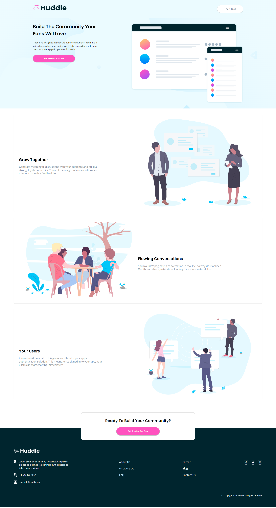

# Frontend Mentor - Huddle landing page with alternating feature blocks solution

This is a solution to the [Huddle landing page with alternating feature blocks challenge on Frontend Mentor](https://www.frontendmentor.io/challenges/huddle-landing-page-with-alternating-feature-blocks-5ca5f5981e82137ec91a5100). Frontend Mentor challenges help you improve your coding skills by building realistic projects. 

## Table of contents

- [Overview](#overview)
  - [The challenge](#the-challenge)
  - [Screenshot](#screenshot)
  - [Links](#links)
- [My process](#my-process)
  - [Built with](#built-with)
  - [What I learned](#what-i-learned)
  - [Continued development](#continued-development)
  - [Useful resources](#useful-resources)
- [Author](#author)
- [Acknowledgments](#acknowledgments)

**Note: Delete this note and update the table of contents based on what sections you keep.**

## Overview

### The challenge

Users should be able to:

- View the optimal layout for the site depending on their device's screen size
- See hover states for all interactive elements on the page

### Screenshot

### Links

- Solution URL: [Github repository](https://github.com/Robertron624/huddle-landing-page-with-alternating-feature-blocks)
- Live Site URL: [Add live site URL here](https://your-live-site-url.com)

## My process

### Built with

- Semantic HTML5 markup
- CSS custom properties
- Flexbox
- CSS Grid
- Mobile-first workflow

### What I learned

This project was a great opportunity to practice my layout and mobile first design skills. I also learned how to use SVGs and how to use the viewBox attribute to correctly giving the correct size.

### Continued development

I want to keep testing my layout skills and keep practicing mobile first design. I also want to keep practicing my CSS skills and keep learning new things.

### Useful resources

- [SVG viewBox](https://developer.mozilla.org/en-US/docs/Web/SVG/Attribute/viewBox) - This helped me understand SVG element viewBox to correctly giving the correct size.
- [CSS Grid](https://css-tricks.com/snippets/css/complete-guide-grid/) - This is an amazing article which helped me to understand CSS Grid. I'd recommend it to anyone still learning this concept.
- [A Modern CSS Reset](https://andy-bell.co.uk/a-modern-css-reset/) - This is an amazing article which helped me to setting up a new project with a modern CSS reset. I'd recommend it to anyone to give it a read.
## Author

-   Personal Website - [Robert Ramirez](https://robert-ramirez.netlify.app)
-   Frontend Mentor User- [@Robertron624](https://www.frontendmentor.io/profile/Robertron624)
-   Twitter - [@robertdowny](https://www.twitter.com/robertdowny)

